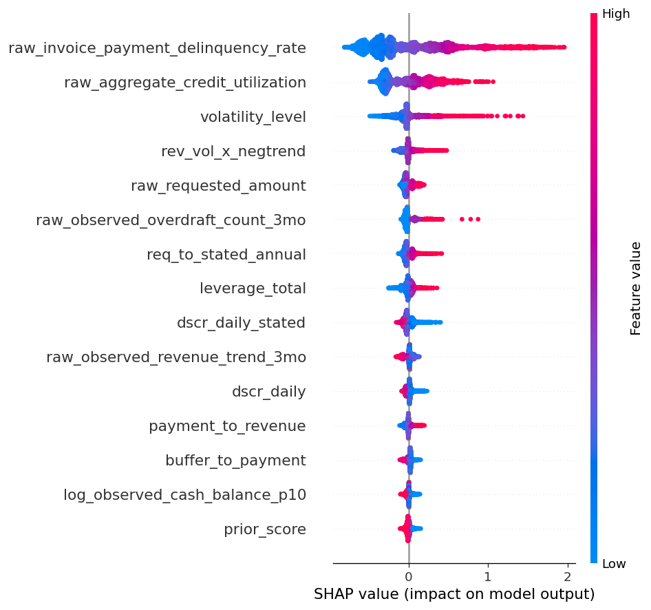

# Deliverable D — Technical Writeup

**Team:** srijith-reddy

## 1. Problem framing & assumptions violated

We are re-underwriting a historical SMB loan book to maximize realized portfolio
NPV, not to maximize classification accuracy. The data breaks several standard ML
assumptions, and each changed our approach:

- **Labels are missing-not-at-random behind a sharp gate.** Repayment outcomes exist
  only for loans the prior lender approved, and approval is, to numerical precision,
  `prior_underwriter_score ≥ 0.273` (AUC 1.0, **0% score overlap** between approved
  and declined). So the training label is selected on a deterministic function of an
  observed covariate — textbook sample-selection bias. Crucially, **inverse-propensity
  reweighting on the score is undefined** (positivity violated); reject inference must
  use overlapping covariates or the regression-discontinuity structure at 0.273. We
  therefore treat PD on *declined* applicants as honest extrapolation and widen its
  intervals.
- **Forward-in-time covariate/label shift.** Train spans 2024-01→2025-06; the scored
  window is the next 13 weeks (2025-07→2025-09), where the default rate drifts 17.4%→
  20.6%. We learn default *timing* on train and *calibrate level* on the in-window
  validation set.
- **Missingness is information, not absence.** "Never declined elsewhere" (null) loans
  default at 14.3% vs 21.3% when present; no-bank-feed at 19.1% vs 16.7%. We encode
  these as first-class indicators rather than imputing them away.
- **Self-reports are optimistically biased.** Applicants who overstate revenue >1.5×
  default at 38.6% vs 16.1%. The *gap* to observed bank-feed revenue is the signal —
  central to our causal treatment of `do(stated_revenue)` below.

## 2. Methodology

**One shared discrete-time model.** The brief's NPV depends on the *default day*
(a day-5 default loses ~the principal; a day-55 default nearly breaks even), and
Deliverable B is the cumulative-default curve. Both consume one timing model. We
model each loan's cumulative curve as `F_i(t) = PD_i · S(t)`, where `PD_i` is a
calibrated probability of default by day 90 and `S(t)` is the canonical normalized
default-timing shape learned on train.

- **PD model:** a 5-fold `GroupKFold`(business_id) LightGBM ensemble on 55 engineered
  features (OOF AUC 0.774, Brier 0.117), then isotonic-calibrated on out-of-fold
  predictions. Features are buffer-centric (loans are ~1.3% of annual revenue, so
  default is cash-buffer-bound, not revenue-bound: daily ACH ≈ $420 vs a p10 cash
  buffer ≈ $1,165, negative 29% of the time), plus discrepancy, informative-missingness,
  credit-stress, platform-history (empirical-Bayes shrunk), and selection (RD-distance)
  families. Every feature is defined by an inspectable function with a declared parent
  set — no black-box pipeline — so each driver is defensible to a regulator.
- **The timing shape `S(t)` is bimodal** and we model it as such: 77.5% of defaults are
  missed-draw events over days 3–60, then a dead zone, then a 22.5% point mass at day 90
  (the open-balance sweep). A smooth survival fit would smear that day-90 mass; our
  shape reproduces the empirical concave-rise → flat → day-90-cliff exactly. The shape is
  **band-conditional** (worse-credit borrowers default ~13 days earlier and carry less
  day-90 mass), so `S(t)` is taken per `owner_personal_credit_band` and used both in B and
  in A's per-loan `E[t*]`.

**Deliverable A — decision = NPV sign.** We approve iff `E[NPV_i | approve] > 0`
using the brief's exact NPV (fee + interest if repaid; `F + D(t*−1) + rec − R` if
default at day `t*`). Because NPV is linear in `t*`, `E[NPV]` uses the expected
default day (≈43) and the empirical recovery fraction (≈9%). This yields a break-even
PD ≈ 0.39 — far above the naive 0.5 threshold — because even defaulters repay ~74% of
the schedule via daily ACH before defaulting. We approve 78% of applicants; the
approved book has mean PD 0.155.

**Deliverable B — shape × level.** `CDR_{w,a} = mean_{i∈A_w} PD_i · S_{band(i)}(a)` over
our approved cohort `A_w`, monotone by construction. Because the PD model has no cohort
signal (train predates the cohort window), we shrink each cohort's **level** toward the
realized validation rate for the same calendar week (empirical-Bayes, pseudo-count 75) —
val and test span the identical 13 weeks, so this transfers.

## 3. Causal reasoning & counterfactual methodology

The counterfactual target is `Pr(y=1 | do(f=v), X_{−f}=x_{−f})`, which differs from
the observational `Pr(y | f=v, X_{−f})` whenever `f` is confounded. Our feature
**registry** is the consistency layer: each engineered feature declares its parents,
so setting a raw feature and recomputing propagates the intervention to exactly its
descendants and nothing else (e.g. `do(requested_amount)` flows to the daily-payment,
buffer-to-payment, leverage, and ask-to-revenue features; everything else is held
fixed). This makes our `do()` a genuine structural perturbation, not an unconstrained
input edit.

We classify the intervenable features by causal status and treat them accordingly:

- **Manipulable causes** — `requested_amount` (changes the real ACH burden),
  `aggregate_credit_utilization`, `existing_debt_obligations`,
  `invoice_payment_delinquency_rate`: we perturb and propagate; the model sensitivity
  is a meaningful interventional effect.
- **Self-reports** — `stated_annual_revenue`, `stated_time_in_business`: `do()` changes
  a *claim*, not the borrower's cash flow, so the true causal effect on default is ≈0.
  An observational model attaches risk to these only via their correlation with the
  *misreporting gap*; reporting that correlation as an interventional effect would be
  the error the brief warns against. We therefore shrink these effects toward zero.
- **Immutable / proxy-by-fiat** — `sector`, `geography_region`, `vintage_years`,
  `has_linked_bank_feed`, `prior_loans_count`: the query set forces `do()` on features
  that are not manipulable policy levers. We answer via model perturbation but flag in
  our uncertainty that these are proxy effects, not actionable causes.

**Regulator defense.** Drivers are explained with SHAP over an inspectable,
de-correlated feature set (Fig. 1). The top drivers by mean |SHAP| are invoice-payment
delinquency, aggregate credit utilization, revenue volatility, requested amount, and
overdraft count, followed by the affordability ratios (leverage, DSCR, buffer-to-
payment) — every one a recognized credit/affordability signal moving in the expected
direction (high delinquency/utilization/volatility raise PD; high DSCR and cash buffer
lower it), and none is a disallowed or proxy-discriminatory attribute. The sharp 0.273
approval cutoff is a natural experiment we can invoke for local causal validity, and we
are explicit about which "effects" are causal versus associational. Several queried
intervention values lie outside observed support (e.g. `prior_loans_count` is in-support
only 29% of the time); those receive wider intervals and an explicit extrapolation caveat.

{width=58%}

## 4. Calibration & uncertainty quantification

- **Point PD** is isotonic-calibrated and **refit on in-window validation** to correct
  the train→window drift (train base rate 17.5% vs window 20.6%); the caveat remains that
  calibration is valid on the approved manifold and extrapolated on declines.
- **90% PD intervals (A, C)** are additive, `p ± α·z·σ`, where σ is fold-ensemble
  disagreement and the width scale `α` is fit by **5-fold cross-fit on validation** (so
  coverage reflects genuine out-of-sample calibration error, not an in-sample collapse).
  Validated: decile coverage ≈ 0.90 at mean width ≈ 0.06.
- **90% trajectory intervals (B)** combine within-cohort bootstrap with a **conformal band
  calibrated against the true validation cohort trajectories** (val is labeled, matured,
  in-window); validated coverage ≈ 0.92.
- The interval–width/coverage trade-off is tuned toward the brief's "contain the truth
  without being needlessly wide"; out-of-support counterfactuals are widened.

## 5. Limitations & what we'd do differently

- **Decline PD is extrapolation** — no decline outcomes exist anywhere, even in
  validation; with more time we'd implement RD-based or covariate-overlap reject
  inference rather than deferring it.
- **Counterfactuals on self-reports and immutable features** are heuristic shrink/
  perturbation rather than a fully specified structural causal model; a learned SCM
  over the intervenable subgraph would be the principled upgrade.
- **Calibration is fit on validation, which is itself approval-selected** — a propensity
  model recovers approval with AUC≈1.0, so approved and declined populations do not
  overlap and inverse-propensity reject inference is infeasible; only RD-style local
  extrapolation is available, which we defer. PD on declines remains an extrapolation.
- The band-conditional timing shape and per-cohort level shrinkage both lean on the
  validation window; with more in-window data we would cross-fit them as well.
